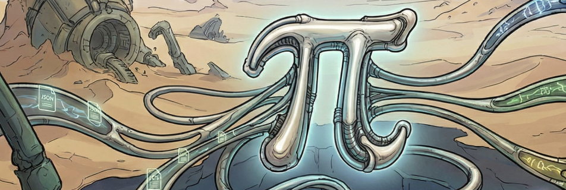

# pi-console & pi-wasm

This solution contains two thin client applications built around a shared orchestration layer utilizing **MQTT "channel mobility" (Pi Calculus)** for dynamic UI generation:

1. **`pi-console`**: A .NET 10 console application that emulates the look and feel of a classic Bulletin Board System layout, built with a modern static approach using `Spectre.Console`.
2. **`pi-wasm`**: A .NET 10 Blazor WebAssembly application that replicates the exact same BBS interface within a web browser, communicating directly over secure WebSockets.

---

## Shared Architecture
To support multiple clients, core business logic, MQTT communication, and layout models are decoupled into the **`Pi.Shared`** library. Each client project (`pi-console` and `pi-wasm`) simply implements the `IUiService` interface to render the dynamic JSON payloads provided by Node-RED into their respective UI frameworks.

## Features
- **Static Layouts**: Uses rendering loops via `AnsiConsole.Live` for the CLI and a CSS Flexbox grid for WASM to display panels without scrolling or breaking layouts.
- **Interactive Menu**: Fully navigatable using the Up/Down Arrow keys in the console, or mouse clicks in the browser.
- **Dynamic Channels (Pi Calculus)**: Uses MQTT "channel mobility" to dynamically subscribe to new communication sessions established via handshakes.
- **Real-time Status Updates**: Subscribes to an MQTT broker to display real-time signal messages and apply `Spectre.Console` color markup translations (e.g. `[green]ONLINE[/]`).

## Requirements
- [.NET 10 SDK](https://dotnet.microsoft.com/download)
- An MQTT broker (Optional but recommended to test the status signals).

## Installation and Execution

1. Clone the repository:
   ```bash
   git clone https://github.com/cerkit/pi-console.git
   ```

2. Make sure you have the required .NET environment set up.

3. **Configure Connection Properties**:
   Both clients are set to connect using **MQTT over WebSockets** (defaulting to `localhost:9001`) to prevent native operating system TCP ghost broker conflicts. 
   The connection strings and targeted `ClientId` (either `pi-console` or `pi-wasm`) are explicitly configured in the individual `Program.cs` files during the `MqttService` dependency injection registration.

4. **Run the CLI Application (`pi-console`)**:
   Navigate to the `pi-console` directory and run:
   ```bash
   cd pi-console
   dotnet run
   ```

5. **Run the Web Application (`pi-wasm`)**:
   Navigate to the `pi-wasm` directory and run:
   ```bash
   cd pi-wasm
   dotnet watch run
   ```
   *Note: The Blazor WASM client relies on the broker having WebSockets exposed (e.g., Mosquitto on Port `9001`).*

## Usage

When the application is running:
- Use the **Up/Down Arrow keys** to scroll through menu items in `pi-console`, or use mouse clicks in the `pi-wasm` browser client.
- Press **Enter** on a menu item (or click it in the browser) to push its label to the Output panel or trigger its dynamic action.
- Press **Q** or **Escape** (or press Enter/click on an item labeled "Logoff" or "Exit") to log off and exit the application safely. Both clients support dynamic Pi Calculus actions passed via the UI layout configuration, processed by a centralized `commandProcessor` that enables powerful runtime controls such as clearing the interface (`CLEAR`) or restarting the orchestration handshake (`RESTART`).

### The Pi Calculus Architecture
This application utilizes a "channel mobility" system for MQTT communication. All application UI configuration occurs dynamically, customized per `ClientId`.

- **Startup**: When the app starts, it publishes a JSON payload `{"clientId": "{ClientId}"}` to the `pi-console/client/startup` topic to announce its presence.

- **Session Handshakes**: The app listens on its targeted `pi-console/handshake/{clientId}` topic for new connection instructions. Handshakes are formatted in JSON:
  ```json
  {"action": "CONNECT", "replyToChannel": "session_id"}
  ```
  or
  ```json
  {"action": "INITIATE_SESSION", "channel": "session_id"}
  ```
  When the application receives a handshake, it reads the dynamic channel string, instantly opens a subscription to that active channel, and registers it in the live "Operations" screen.

- **Dynamic Menus and UI Configs**: If an `INITIATE_SESSION` handshake is requested, the application publishes a `{"status": "READY"}` payload back to the dynamic channel. The Node-RED backend looks up the requested `clientId` in its configuration dictionary and serves targeted UI layout parameters and menu options down the secure channel. 
  - Expected JSON format for a menu array:
    ```json
    [
      { "id": 1, "label": "System Status", "icon": "info", "color": "green" },
      { "id": 2, "label": "Device Settings", "icon": "settings", "color": "purple" }
    ]
    ```

- **Global Messages**: If messages are published to `pi-console/status` on your MQTT broker, they will appear dynamically in the System Status panel at the bottom.

## Technology Stack
- **.NET 10**
- **Pi.Shared**: Class Library for Shared Domain Models and Services.
- **pi-console**: CLI built using `Spectre.Console` layout management and widgets.
- **pi-wasm**: Browser client built using `Blazor WebAssembly`.
- **MQTTnet**: Used for remote telemetry, supporting both TCP sockets and WebSockets.

## Standard AI Development Prompt
```
Please read the `NodeRed_Architecture.md` file located in the root of the workspace to understand the current Pi Calculus orchestration, MQTT topics, and JSON payload schemas.  

Task: 
[Insert your specific goal here, e.g., "Implement the ClientId property in the shared library and update the startup sequence to publish to the targeted public handshake topic as defined in the architecture document."]

Constraints:
- Ensure all core MQTT and Pi Calculus logic goes into the shared library.
- Keep UI-specific rendering inside the `pi-console` or `pi-wasm` projects.
```